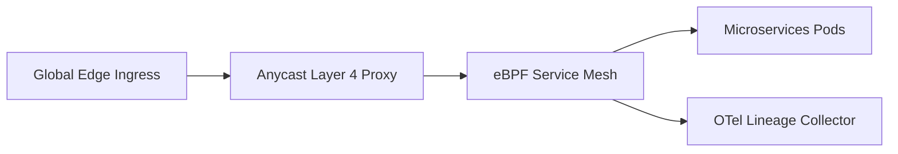

# Marp Markdown & Python-PPTX Slide Deck Generation

## Overview

A structured technical specification and automation engine for authoring executive-ready presentation decks. Translating raw requirements, technical architectures, and financial tables into visually coherent slides is often slow, manual, and prone to poor visual formatting. This skill equips AI agents to construct declarative presentations using Marp Markdown (converting Markdown to 16:9 widescreen HTML, PDF, and PowerPoint) and programmatic Python scripts using `python-pptx` for dynamically generated charts, tables, and branded layouts.

## When to Use

- Converting engineering design documents (RFCs), post-mortems, or architecture blueprints into conference or executive slide decks.
- Programmatically generating data-driven pitch decks, financial updates, or quarterly business reviews (QBRs).
- Building repeatable CI/CD pipelines that compile documentation repositories into version-controlled PDF/PPTX presentations.
- Formatting code-heavy presentations with syntax highlighting, columns, and presenter notes.

## When NOT to Use

- Generating freeform hand-drawn illustrations or vector diagrams (use SVG, Mermaid, or Excalidraw).
- Single-page static PDF reports without slide boundaries (use Typst or LaTeX).

## Inputs & Prerequisites

- Presentation outline, target audience (technical team vs C-suite executives), and key takeaways.
- Brand design tokens (primary accent color, background tone, font families, logo assets).
- Node.js environment with `@marp-team/marp-cli` installed or Python environment with `python-pptx`.

## Core Workflow

### 1. Marp Declarative Presentation Template
Structure slides using YAML frontmatter directives, 16:9 widescreen aspect ratios, and custom scoped CSS:

```markdown
---
marp: true
theme: default
paginate: true
header: "Cloud Platform Architecture 2026"
footer: "Confidential - Internal Engineering Review"
size: 16:9
style: |
  section {
    background-color: #0f172a;
    color: #f8fafc;
    font-family: 'Inter', -apple-system, sans-serif;
    padding: 40px 60px;
  }
  h1 { color: #38bdf8; font-weight: 700; }
  h2 { color: #818cf8; }
  footer { color: #64748b; font-size: 0.65rem; }
  header { color: #64748b; font-size: 0.65rem; }
  .highlight { color: #f59e0b; font-weight: bold; }
  .grid-2 { display: grid; grid-template-columns: 1fr 1fr; gap: 30px; }
---

<!-- _class: lead -->
<!-- _paginate: false -->
# Next-Gen Distributed Mesh
### Scalable Multi-Region Ingress & Zero-Trust Telemetry

**Presented by:** Cloud Infrastructure Architecture Team  
**Date:** October 2026

---

## Executive Problem Statement

<div class="grid-2">

<div>

### Current Challenges
- **Latency Bottlenecks**: Inter-region traffic incurs 140ms p95 roundtrip delays.
- **Fragmented Identity**: 3 divergent auth systems across legacy clusters.
- **Cost Scaling**: Redundant NAT gateways cost \$42,000/month in egress.

</div>

<div>

### Target Architecture Goals
- Consolidate on eBPF-powered Cilium service mesh.
- Achieve sub-25ms global edge routing with Anycast BGP.
- Eliminate 60% of idle cloud egress costs.

</div>

</div>

<!--
Speaker Notes:
- Emphasize the $42k/mo egress waste as the primary financial driver.
- Confirm security approval from InfoSec before committing to Cilium v1.16 timeline.
-->

---

## Core System Architecture



- **Zero-Trust**: Mutual TLS (mTLS) enforced at kernel layer via SPIFFE/SPIRE.
- **Observability**: Distributed OpenTelemetry tracing on 100% of ingress requests.
```

### 2. Programmatic Python Deck Generation (`python-pptx`)
Automate creation of formatted PowerPoint tables and metrics:

```python
"""Programmatic PowerPoint deck generator using python-pptx."""
from pptx import Presentation
from pptx.util import Inches, Pt
from pptx.dml.color import RGBColor
from pptx.enum.text import PP_ALIGN

def create_executive_deck(output_filename: str = "executive_summary.pptx"):
    prs = Presentation()
    prs.slide_width = Inches(13.333)  # 16:9 widescreen width
    prs.slide_height = Inches(7.5)    # 16:9 widescreen height
    blank_slide_layout = prs.slide_layouts[6]

    slide = prs.slides.add_slide(blank_slide_layout)

    # Title Box
    title_box = slide.shapes.add_textbox(Inches(0.8), Inches(0.8), Inches(11.7), Inches(1.2))
    tf = title_box.text_frame
    tf.word_wrap = True
    p = tf.paragraphs[0]
    p.text = "Q3 Infrastructure Efficiency & Cost Optimization"
    p.font.size = Pt(28)
    p.font.bold = True
    p.font.color.rgb = RGBColor(15, 23, 42)

    # KPI Metric Card 1
    card1 = slide.shapes.add_textbox(Inches(0.8), Inches(2.5), Inches(3.6), Inches(2.2))
    c1_tf = card1.text_frame
    c1_tf.word_wrap = True
    p1 = c1_tf.paragraphs[0]
    p1.text = "Monthly Savings"
    p1.font.size = Pt(14)
    p1.font.color.rgb = RGBColor(100, 116, 139)
    p2 = c1_tf.add_paragraph()
    p2.text = "$124,500"
    p2.font.size = Pt(36)
    p2.font.bold = True
    p2.font.color.rgb = RGBColor(16, 185, 129)

    # KPI Metric Card 2
    card2 = slide.shapes.add_textbox(Inches(4.8), Inches(2.5), Inches(3.6), Inches(2.2))
    c2_tf = card2.text_frame
    c2_tf.word_wrap = True
    p3 = c2_tf.paragraphs[0]
    p3.text = "p95 Latency Reduction"
    p3.font.size = Pt(14)
    p3.font.color.rgb = RGBColor(100, 116, 139)
    p4 = c2_tf.add_paragraph()
    p4.text = "-48.2%"
    p4.font.size = Pt(36)
    p4.font.bold = True
    p4.font.color.rgb = RGBColor(56, 189, 248)

    prs.save(output_filename)
    print(f"Generated widescreen presentation: {output_filename}")

if __name__ == "__main__":
    create_executive_deck()
```

### 3. Automated Compilation CLI Commands
Compile Marp markdown directly into production distribution formats:
```bash
# Compile to self-contained interactive HTML presentation
marp --html presentation.md -o presentation.html

# Compile to PDF with speaker notes included
marp --pdf presentation.md -o presentation.pdf

# Compile to editable Microsoft PowerPoint (.pptx)
marp --pptx presentation.md -o presentation.pptx
```

## Best Practices & Failure Modes

- **Slide Overcrowding**: Never place more than 6 bullet points or 2 primary ideas on a single slide; split into subsequent slides using `---`.
- **Contrast Ratios**: Maintain WCAG AA compliance (contrast ratio >= 4.5:1) between text and slide background colors.
- **Code Block Overflow**: Always specify language syntax and keep code snippets under 12 lines per slide to avoid vertical text clipping.

## Verification & Testing

- Verify python-pptx compilation:
  ```bash
  python -c "import pptx; print('python-pptx library ready')"
  ```
- Test Marp CLI installation:
  ```bash
  marp --version || echo "Marp CLI can be run via npx @marp-team/marp-cli"
  ```
