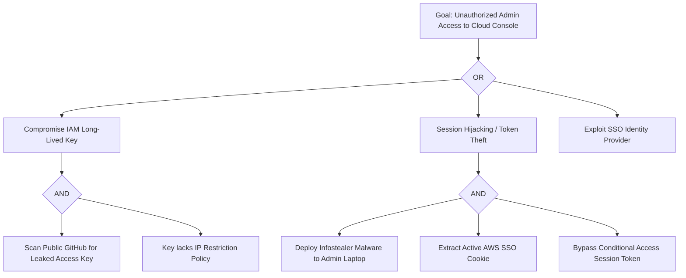

# Threat Modeling & Hierarchical Attack Tree Construction

## Overview

A structured security engineering framework for modeling adversary tactics, calculating compromise probabilities, and designing defensive mitigations using hierarchical Attack Trees (Schneier methodology). While high-level threat frameworks like STRIDE enumerate abstract categories of risk, Attack Trees mathematically decompose a root compromise goal (e.g., "Exfiltrate Customer Database") into logical AND/OR conditions across concrete attack surfaces. This skill guides security architects, penetration testers, and AI agents in constructing valid attack trees, quantifying adversary cost vs. payoff, and prioritizing security controls.

```
                     [ Root Goal: Compromise Production DB ]
                                        |
                 +----------------------+----------------------+ (OR)
                 |                                             |
    [ Target: Exfiltrate via SQLi ]              [ Target: Stolen IAM Credentials ]
                 |                                             |
        +--------+--------+ (AND)                     +--------+--------+ (AND)
        |                 |                           |                 |
 [ Find Unsanitized ] [ Bypass WAF ]           [ Phish Admin Key ] [ Bypass MFA ]
```

## When to Use

- Performing architecture threat assessments during design phases for cloud, fintech, or healthcare infrastructure.
- Evaluating the security posture of an existing software system prior to third-party penetration testing.
- Quantifying the ROI of security mitigations (e.g., measuring whether implementing WebAuthn MFA breaks the lowest-cost attack path).
- Formalizing attack chains for incident response table-top exercises.

## When NOT to Use

- Automated low-level vulnerability scanning (e.g., running Semgrep, Trivy, or OWASP ZAP).
- Writing exploitation payloads or exploit automation code.

## Inputs & Prerequisites

- System architecture diagrams, data flow diagrams (DFD), trust boundaries, and asset inventory.
- Target threat actor profiles (opportunistic script kiddie, cybercriminal group, malicious insider, nation-state).
- Graphing utilities (Mermaid.js or Graphviz) for tree rendering.

## Core Workflow

### Step 1: Root Goal Identification and Scope
Select an attacker-centric root objective focused on critical asset compromise rather than an abstract vulnerability:
- *Bad*: "SQL Injection in User Profile" (Vulnerability, not goal).
- *Good*: "Exfiltrate Unencrypted PII from Customer Database" (Root objective).

### Step 2: Hierarchical Node Decomposition (AND/OR Logic)
Decompose nodes top-down into logical prerequisites:
- **OR Nodes**: The attacker succeeds if *any* single child node succeeds (multiple alternate paths).
- **AND Nodes**: The attacker succeeds *only if all* child nodes succeed (chained prerequisites).



### Step 3: Adversary Cost and Feasibility Quantification
Assign standard quantitative attributes to each leaf node:
- **Cost**: Financial expenditure required (Low: <$100, Medium: <$10k, High: >$10k).
- **Skill Required**: Novice, Intermediate, Advanced, Elite/Nation-State.
- **Likelihood**: Probability of success within 12 months (0.0 to 1.0).
- **Detection Probability**: Chance of triggering an alert during execution.

### Step 4: Defense Mapping & Cut-Set Identification
Identify the "Minimal Cut Set"—the smallest combination of defensive mitigations that completely severs all valid attack paths leading to the root goal:

| Leaf Node Attack Vector | Defensive Countermeasure | Impact on Attack Tree |
|---|---|---|
| Leaked Access Keys in Git | Git pre-commit secret scanning + short-lived AWS IAM Identity Center tokens | Completely eliminates Path A |
| Cookie Theft via Infostealer | FIDO2 / WebAuthn Hardware Security Keys (Device-bound credentials) | Cuts Path B session reuse |
| SSO Credential Stuffing | Phishing-resistant MFA + Risk-based conditional access policies | Cuts Path C |

## Best Practices & Failure Modes

- **Avoid Infinite Leaf Explosion**: Stop decomposing when reaching standard primitives (e.g., "Exploit known CVE in unpatched nginx") rather than modeling compiler internals.
- **Strict AND/OR Semantics**: Ensure intermediate nodes explicitly declare whether children are independent options (OR) or mandatory steps in a sequential chain (AND).
- **Keep Trees Dynamic**: Update trees when defensive controls change or when new public exploit techniques are disclosed.

## Verification & Testing

1. Verify that every path from root to leaves contains valid logical transitions without circular loops.
2. Confirm that proposed defensive controls break at least one node in every branch of an OR set.
3. Validate tree syntax with Mermaid linting or Graphviz compile tests.
